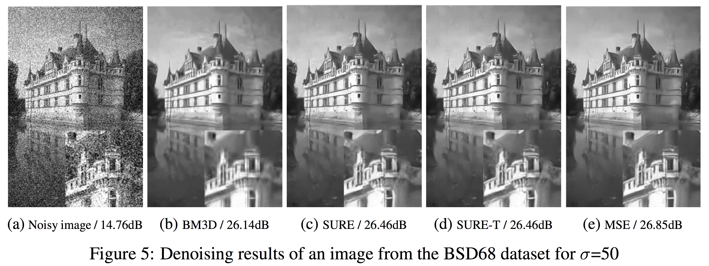

# Training deep learning based denoisers without ground truth data - Official Tensorflow implementation of the NeurIPS 2018 paper

**Shakarim Soltanayev, Se Young Chun**

**Abstract:**

*Recently developed deep-learning-based denoisers often outperform state-of-the-art conventional denoisers, such as the BM3D. They are typically trained to minimizethe mean squared error (MSE) between the output image of a deep neural networkand a ground truth image. In deep learning based denoisers, it is important to use high quality noiseless ground truth data for high performance, but it is often challenging or even infeasible to obtain noiseless images in application areas such as hyperspectral remote sensing and medical imaging. In this article, we propose a method based on Stein’s unbiased risk estimator (SURE) for training deep neural network denoisers only based on the use of noisy images. We demonstrate that our SURE-based method, without the use of ground truth data, is able to train deep neural network denoisers to yield performances close to those networks trained with ground truth, and to outperform the state-of-the-art denoiser BM3D. Further improvements were achieved when noisy test images were used for training of denoiser networks using our proposed SURE-based method.*

## Resources
* [Paper and supplementary materials](https://papers.nips.cc/paper/7587-training-deep-learning-based-denoisers-without-ground-truth-data)
* Contact: Shakarim Soltanayev (shakarim94@gmail.com), (shakarim@unist.ac.kr)

## Results from the paper





## Getting Started

This code was tested with Python 2.7. It is highly recommended to use the GPU version of Tensorflow for fast training.

### Prerequisites
```
numpy==1.14.5
scipy==1.1.0
tensorflow==1.10.0
```

## Training the network

The code will automatically download the MNIST dataset.
To train the network with SURE:
```
python2 main.py --phase train --cost sure --sigma 50.0
```
To train the network with MSE:
```
python2 main.py --phase train --cost mse --sigma 50.0
```
You can also control other paramaters such as batch size, epsilon value (Eq. 6 from the paper). More info inside main.py.

The checkpoints are saved in ./checkpoint folder. Denoised validation images are saved after each epoch in ./sample folder.

### Tensorboard summaries
```
tensorboard --logdir=./logs
```

## Testing using the trained network

To test the network that was trained with SURE:
```
python2 main.py --phase test --cost sure --sigma 50.0
```

To test the network that was trained with MSE:
```
python2 main.py --phase test --cost mse --sigma 50.0
```

Denoised images are saved in ./test folder.


## Using Net-SURE for your own models

You can easily implement SURE-based training in your networks. Lines 60-90 in model.py explain the SURE estimation, which is vectorized for efficient trainining. You may need to slightly modify it depending on the characteristics of your model  (e.g. different input image shape). More instructions are given in the paper and the code.

### Epsilon parameter
In the Eq. 6 of the paper, a small epsilon value is needed for SURE estimation. In this code the SURE estimation works well for a wide range of epsilon values ([1e-2, 1e-7]), therefore it is fixed to 1e-4. However, as discussed in the paper for more complex networks SURE estimation can be sensitive to epsilon value. You may need to tune the epsilon value using a validation set as we did for the DnCNN network in the paper.

### DnCNN-SURE
You can get started with the [DnCNN-Tensorflow](https://github.com/crisb-DUT/DnCNN-tensorflow) to implement DnCNN-SURE.
 * SURE estimation is almost the same, except set as x_dim=tf.to_float(tf.shape(self.Y)[1]) (side length of square input image).
 * Add the noise only once at the beginning of the training. To do this remove tensor for the noisy image and replace it with a placeholder and feed a noisy image during training just as in MNIST case (lines 181-183 of our code).
 * Change epsilon value to self.eps = self.sigma\*1.4\*self.sigma, this is a tuned value for DnCNN. You can set the epsilon similarly for your own model.

## Acknowledgements
* We thank @crisb-DUT for his repository [DnCNN-Tensorflow](https://github.com/crisb-DUT/DnCNN-tensorflow) as our code structure closely follows it (dataset import and feeding, loading checkpoints etc.).


